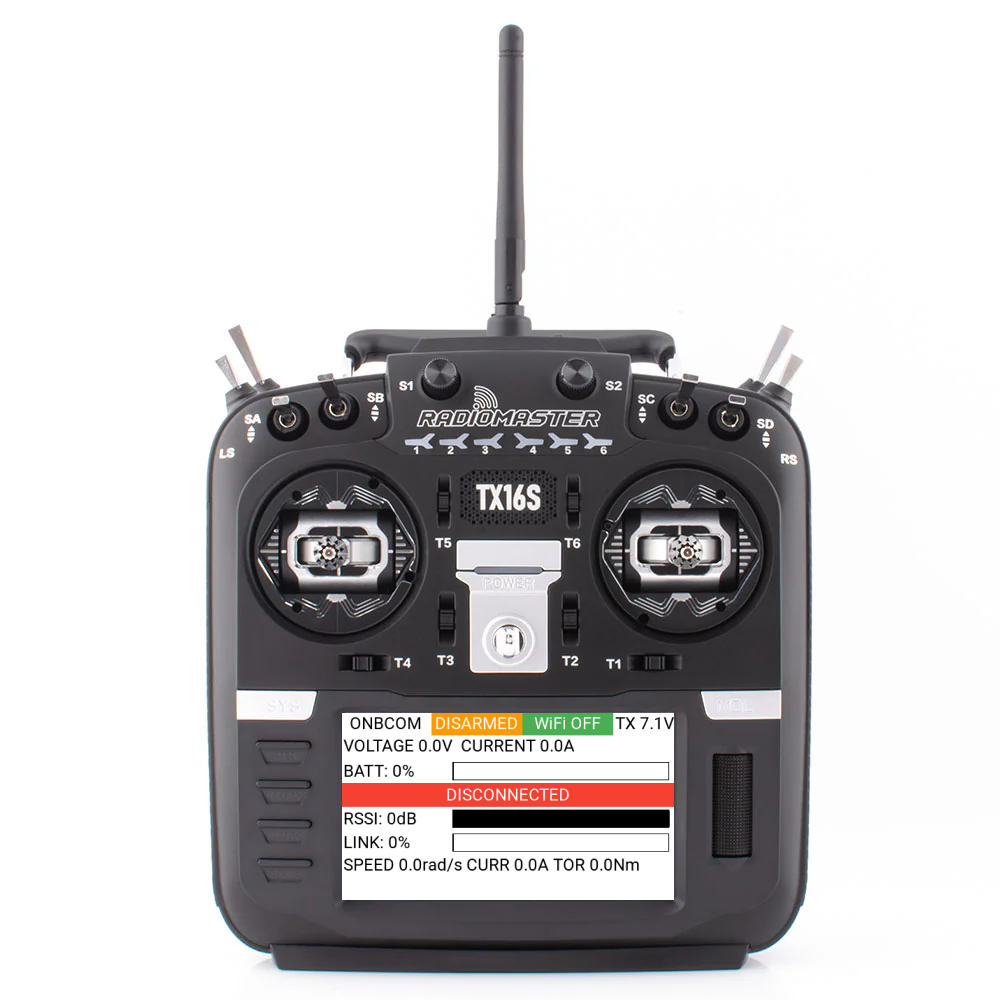

# Q-Octo EdgeTX Transmitter User Interface

## Related Repositories

* MCU code: https://github.com/q-octo/embedded-code
* CAD design: https://github.com/JoshPattman/q-octo-cad
* CRSF Reciever for the RP2040 (Raspberry Pi Pico): https://github.com/britannio/pico_crsf

Developed for the TX16S Mark II Radio Controller.
Custom telemetry is sent from the MCU as a CRSF packet to support displaying motor data.

`main.lua` is temporarily an invisible symlink but the latest code is available from `lua_script_backup.lua`.

EdgeTX Lua documentation is available via https://luadoc.edgetx.org/.

